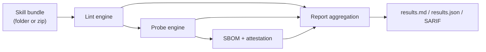

# Technical Overview

## Architecture

## Core runtime flow

1. `lint` validates schema, policy patterns, and metadata constraints.
2. `probe` evaluates risky execution patterns and optional sandboxed behavior.
3. `attest` generates provenance-linked artifacts.
4. `report` aggregates all outputs and can enforce release gates.

## Policy and governance model

- Built-in policy packs: `strict`, `balanced`, `research`, `enterprise`.
- Policy version pinning via `--policy-version` prevents silent drift.
- Trust-gate presets (`standard` / `strict`) support CI release controls.

## Operational integration

- CLI-first for local and CI use.
- SARIF export for code scanning UIs.
- Git diff scoping (`diff`) for PR-focused checks.
- Deterministic safe remediation planning/application (`fix`).

## Security posture

- Default-deny network and write posture in policy.
- Optional runtime sandbox execution on macOS/Linux.
- Explicit waivers recorded in attestation for traceability.

## Key artifacts

- `.skillcheck/<skill>.lint.json`
- `.skillcheck/<skill>.probe.json`
- `.skillcheck/<skill>.attestation.json`
- `.skillcheck/results.md`
- `.skillcheck/results.json`
- `.skillcheck/results.sarif` (optional)
